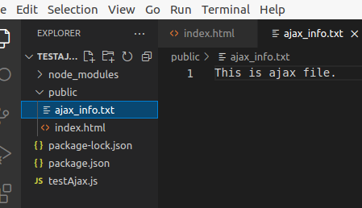

# ajax使用

1.第一个程序运行要求

<!DOCTYPE html>

<html>

<body>

<h1>XMLHttpRequest 对象--------wt-------</h1>

`<button type="button" onclick="loadDoc()">修改内容</button>`

</body>

</html>

程序中有个按钮：

`<button type="button" onclick="loadDoc()">修改内容</button>`

按钮有个onclick事件，调用了loadDoc（），在loadDoc（）中有

`xhttp.open("GET", "/ajax_info.txt", true);`

说明要用get方法访问服务器的ajax_info.txt内容。所以建立服务器，为了不跨域，把页面也从服务器发送。

服务器程序：

`const express=require("express")`

`const app=express()`

`app.use('/',express.static('public'))`

`app.listen(10627)`

服务器文件结构：

服务器与index.html页面中的ajax访问路径/ajax_info.txt有对应内容，可以完成正常访问。

# 2.ajax程序分析

1）var xhttp = new XMLHttpRequest();

生成一个用xml访问http服务器请求的实例

所有现代浏览器都支持 XMLHttpRequest 对象。

XMLHttpRequest 对象用于同幕后服务器交换数据。这意味着可以更新网页的部分，而不需要重新加载整个页面。

2）readyState 

| readyState | 保存了 XMLHttpRequest 的状态。0: 请求未初始化1: 服务器连接已建立2: 请求已接收3: 正在处理请求4: 请求已完成且响应已就绪 |
| ---------- | ------------------------------------------------------------ |
|            |                                                              |

